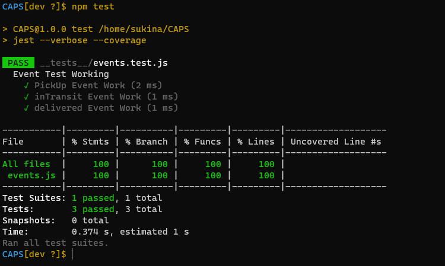
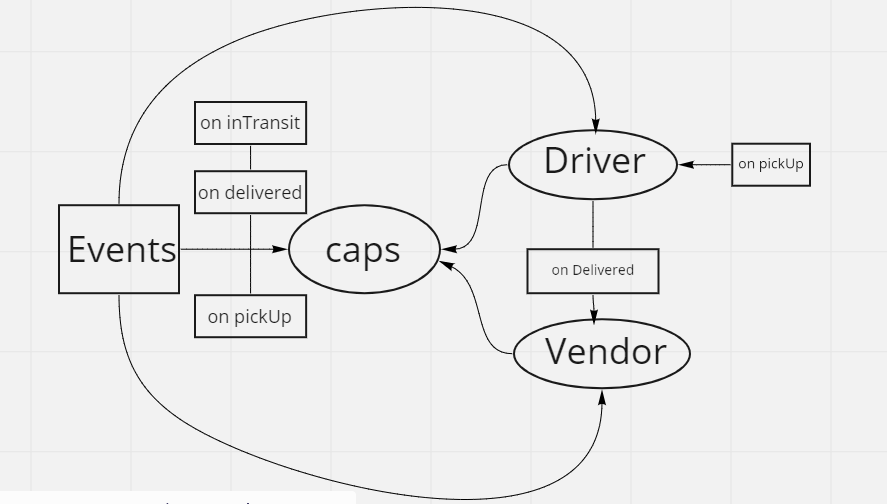

# CAPS

### Event Driven Application :

#### Auther : Sukina AbuHammad

[Pull Request](https://github.com/Sukina12/CAPS/pull/1)

[Actions](https://github.com/Sukina12/CAPS/actions)

#### SetUp :
  1. clone the repo
  2. .env :
      STORE = Sukina Flower
  3. npm i
  4. running the app : on node caps.js
      (nodemon)

#### Tests :
  * npm test

  

#### UML :
